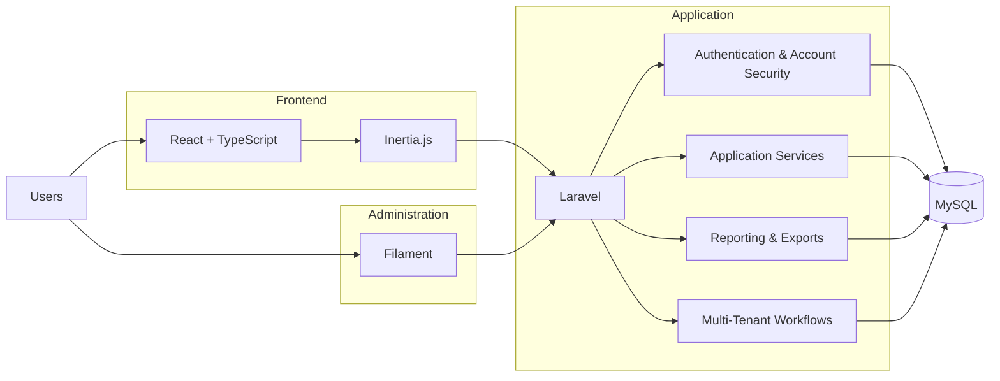

# Architecture Overview

This document provides a simplified public overview of the Language Center Management System architecture.

It intentionally excludes private implementation details, credentials, database schemas, sensitive configuration, and private application source code.

## High-Level Architecture

## Frontend Layer

The interactive application interface is built with:

- React
- TypeScript
- Inertia.js

Inertia.js connects the Laravel application with React while keeping the application within a unified full-stack architecture.

## Application Layer

Laravel provides the main application and business-logic layer, including:

- Authentication
- Authorization
- Account-security workflows
- Application services
- Reporting
- Data access
- Multi-tenant behavior

## Administrative Layer

Filament provides administrative interfaces and management workflows integrated directly with the Laravel application.

## Data Layer

MySQL is used as the relational database layer.

Detailed database schemas, migrations, and application data are intentionally excluded from this public repository.

## Authentication & Account Security

The project includes structured account-security workflows such as:

- User authentication
- Authorization
- Failed-login handling
- Temporary account lockout
- Password-related workflows
- Center-aware account access

Detailed security implementation remains private.

## Reporting

The platform includes structured reporting and export functionality.

Critical reporting behavior is covered by automated tests to improve reliability as the system evolves.

## Multi-Tenant Workflows

The application supports workflows that are aware of organizational and center-level context.

Only the high-level architectural concept is presented publicly. Internal tenancy implementation remains in the private source repository.

## Testing

Automated tests are used for critical application behavior, particularly around reporting and business logic.

The public showcase describes the testing approach without exposing internal test cases or implementation details.

## Repository Scope

This repository is intentionally limited to project presentation and high-level technical documentation.

It does not contain:

- Private application source code
- Private database schemas
- Application credentials
- Environment configuration
- Internal business rules
- Sensitive project data
